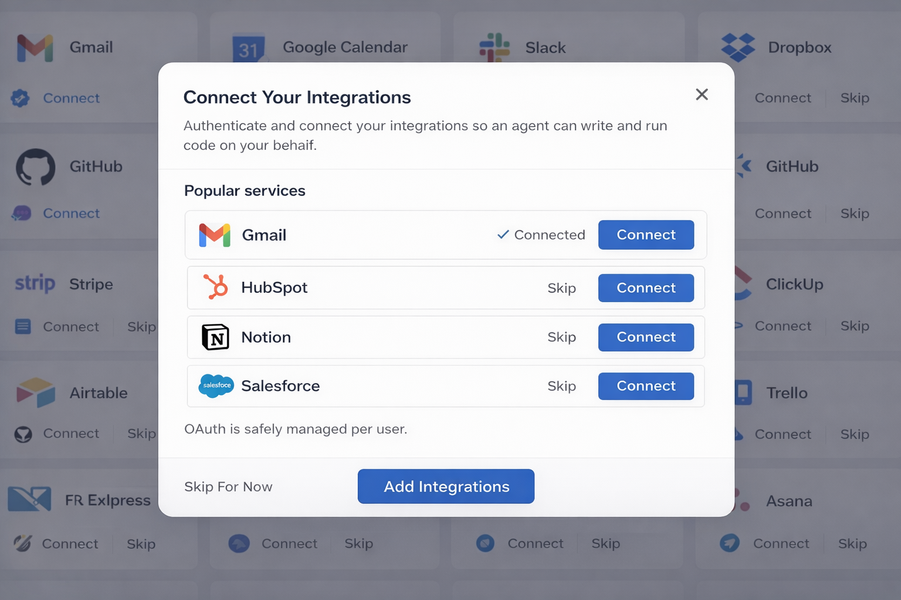
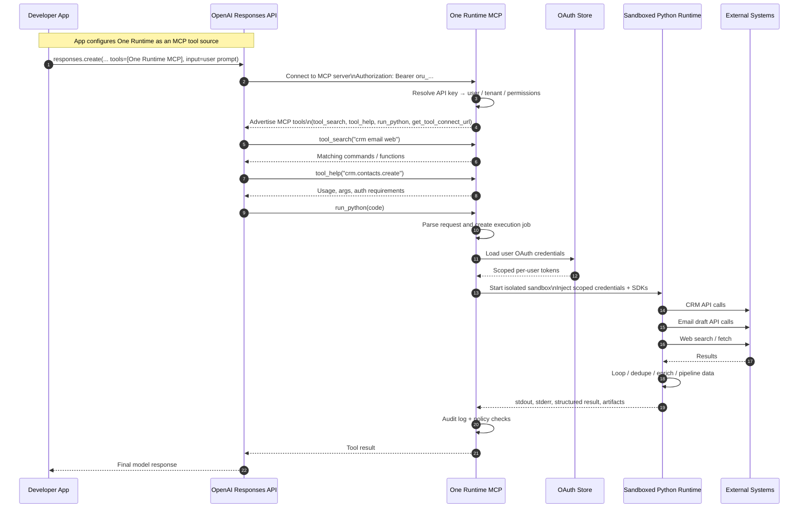

# One Runtime

**An MCP server that turns tool calls into program execution.**

OAuth, 100's of integrations, and sandboxed runtime — all in one place.

## The Problem

To understand the problem One Runtime solves, imagine your agent is given the following task:

<p align="center">
  
</p>

```
Take this photo of business cards and:

* Extract all contacts
* Add them to the CRM (skip duplicates)
* Enrich each contact using web research
* Draft a follow-up email for each new contact
```

Breaks down into real system problems:

- 🔐 Managing and securing OAuth across multiple integrations (CRM, email, etc.)
- 🧩 Tool bloat — hundreds of integrations means hundreds of tool definitions
- 🧠 Context bloat — too many tools degrade model performance
- 🔁 Multiple tool calls — each step requires another round trip through the model
- ⚙️ No execution model — no loops, no state, no composition
- 🧪 No safe runtime — logic lives in prompts, not in a sandbox

## The Solution

Give agents programmtic access to integrations.

Instead of calling tools, the agent writes and executes code:

```python
from one_runtime import crm, web, email, vision

contacts = vision.extract_contacts(image)

for c in contacts:
    existing = crm.contacts.search(email=c["email"])

    if not existing:
        crm.contacts.create(...)
        email.drafts.create(...)

    data = web.search(f"{c['name']} {c['company']}")
```

> One Runtime cuts tool-definition tokens by **90%+** and reduces multi-step agent round trips by **80%+**. Less costs and faster results.

## What One Runtime does

- 🔐 Manages and secures OAuth per user
  - Each user connects their own accounts
  - Supports managed OAuth or bring-your-own credentials

- 🧩 Converts pre-built APIs into python functions
  - functions the model can call
  - No need to define hundreds of tools in prompts
  - No need to build your own integrations

- 🔍 Eliminates tool bloat
  - Small, discoverable interface (`tool_search`, `tool_help`)

- 🐍 Executes code in a sandbox
  - Safe, isolated runtime
  - Agents can run loops, branching, retries

- 🔁 Enables pipelining
  - Data flows through a single program
  - No repeated LLM round trips

- 🌐 Unifies web + APIs
  - `web.search`, `web.fetch`, and integrations in one place

## We've built the integrations and the Oauth2 workflow

Give your users access to our library of integrations and secure Oath2 workflows.

<p align="center">
  
</p>

We provide an API that gives you icons, descriptions and tools for all our integrations so you can easily build tool selection workflows.

## Example Code

A typical model call could look like this.

```python
from openai import OpenAI

client = OpenAI()

response = client.responses.create(
    model="gpt-5.4",
    tools=[
        {
            "type": "mcp",
            "server_url": "https://app.one-runtime.com/v1/mcp",
            "headers": {
                "Authorization": "Bearer oru_abc123"
            }
        }
    ],
    input=[
        {
            "role": "user",
            "content": [
                {
                    "type": "input_text",
                    "text": """Take this photo of business cards and:

- Extract all contacts
- Add them to the CRM (skip duplicates)
- Enrich each contact using web research
- Draft a follow-up email for each new contact

Return a summary of what was created and updated."""
                },
                {
                    "type": "input_image",
                    "image_url": "https://your-domain.com/images/business-cards.jpg",
                    "detail": "high"
                }
            ]
        }
    ]
)

print(response.output_text)
```

## Typical Sequence

Most of the interaction with integrations happen in the sandbox reducing token usage and execution time.


