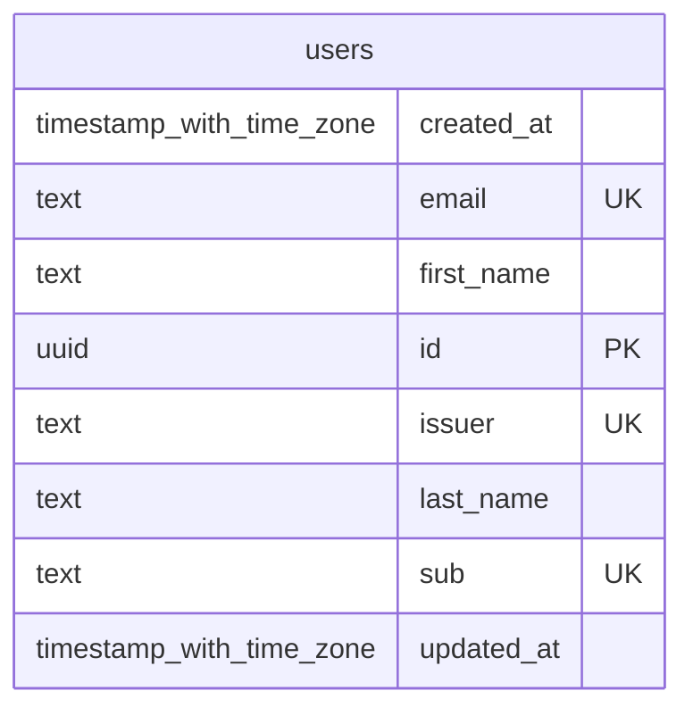
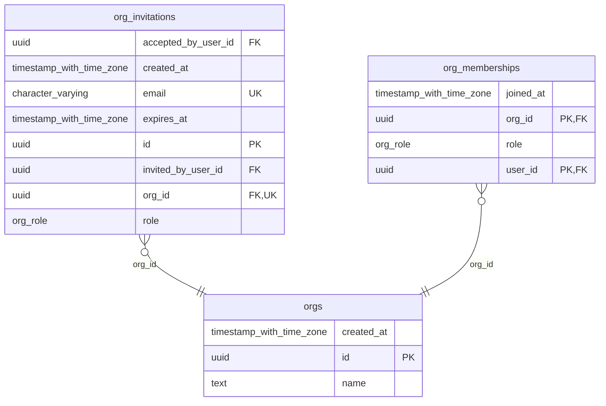
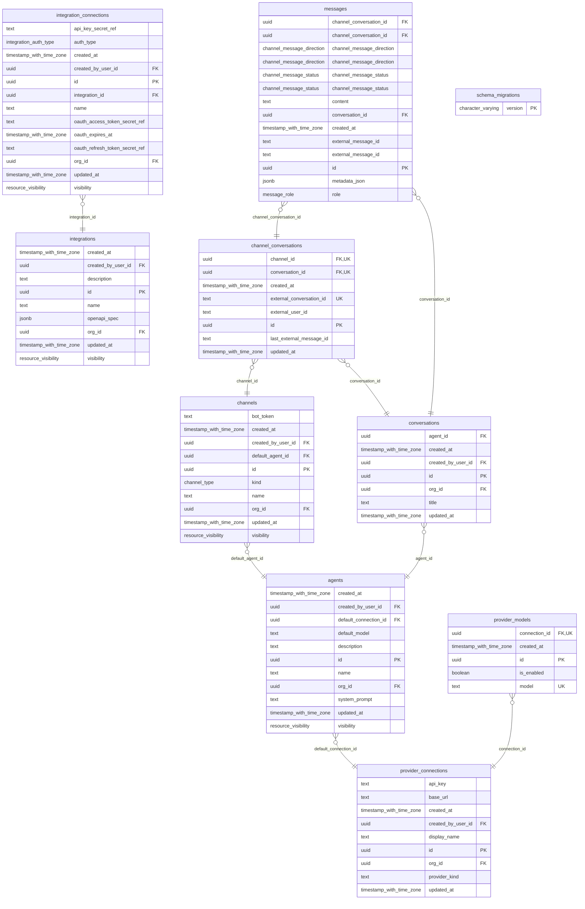

## Database

This crate owns the application database schema and generated query layer.

We use:

- `dbmate` for schema migrations in [`migrations/`](migrations/)
- `clorinde` for generating typed Rust query code from SQL files in [`queries/`](queries/)
- `just -f crates/db/Justfile db-diagram` to refresh schema diagrams in this file from a live database

The diagram task expects `DATABASE_URL` to point at a database with the current migrations applied.

## Current Shape

The database is currently split across three schemas:

- `auth`: authentication identities and sessions
- `org`: multi-tenant organization data, membership rules, invitations, and helper functions used by RLS
- `public`: product tables used by the application

## Main Tables

The key tables today are:

- `auth.users`
- `auth.sessions`
- `org.orgs`
- `org.org_memberships`
- `org.org_invitations`
- `public.provider_connections`
- `public.provider_models`
- `public.agents`
- `public.conversations`
- `public.messages`
- `public.channels`
- `public.integrations`
- `public.integration_connections`

The `public` schema also contains shared enum types such as `resource_visibility`, `message_role`, `channel_type`, and `integration_auth_type`.

## Schema Diagrams

Run `just -f crates/db/Justfile db-diagram` to replace the generated diagrams below with fresh output from the current database.

<!-- schemas-start -->
### `auth`

Authentication users and sessions.

### `org`

Organization tenancy, memberships, invitations, and org helper functions.

### `public`

Application domain tables: providers, agents, conversations, channels, integrations, and shared enum types.

<!-- schemas-end -->

## Notes

- Most application tables are org-scoped and use row-level security policies built on `org.is_org_member(...)` and `org.is_org_admin(...)`.
- Resource-style tables use `resource_visibility` to distinguish `private` rows from `org`-shared rows.
- Secrets are stored outside the database; the schema stores secret references only.
